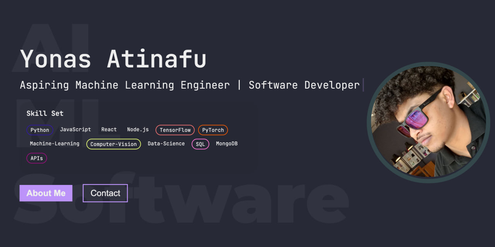

# VScode Portfolio

A Visual Studio Code themed developer portfolio website built with Next.js and deployed on Vercel.

## Environment Variables

To handle sensitive data such as API keys securely, we use environment variables. To set up your environment variables:

1. Create an `.env.local` file in the root of your project directory.
2. Refer to the `.env.local.example` file for the required variables format and necessary values. This typically includes API keys and other sensitive information that should not be hard-coded into your application code.

## Setting Up the Development Server

To get the development server running on your local machine, follow these steps:

### Install dependencies
`npm install`
#### or
`yarn install`

### Start the development server
`npm run dev`
#### or
`yarn dev`

After running the above commands, open http://localhost:3000 in your browser to see the application in action. The development server provides hot reloading, so your changes will be visible immediately.

## Project Structure
- components/: Contains reusable UI components like Sidebar and Tabsbar. Modify these components to change the layout or add new UI elements.
- pages/: Each file in this directory corresponds to a route in the web application. Modify or add new files here to create additional pages.
- public/: Static files like images and fonts are stored here.
- styles/: Contains CSS files for styling the application. Utilize modular CSS for component-specific styles.

## Next.js Resources

To deepen your understanding of Next.js and expand your capabilities with this framework, consider the following resources:

- [Next.js Documentation](https://nextjs.org/docs) - Comprehensive resource covering Next.js features and API.
- [Learn Next.js](https://nextjs.org/learn) - An interactive Next.js tutorial that guides you through building a complete Next.js project.
- [Explore the Next.js GitHub repository](https://github.com/vercel/next.js/) for source code and contributions.

## Deploy on Vercel

Deploying your Next.js app is streamlined with the Vercel platform, directly from the creators of Next.js. Follow these steps for deployment:

1. Visit [Vercel's Deployment Platform](https://vercel.com/new?utm_medium=default-template&filter=next.js&utm_source=create-next-app&utm_campaign=create-next-app-readme).
2. Connect your GitHub repository to auto-deploy your Next.js app upon each push to the repository, or manually deploy by uploading your project.

For detailed instructions, check the [Next.js deployment documentation](https://nextjs.org/docs/deployment).
